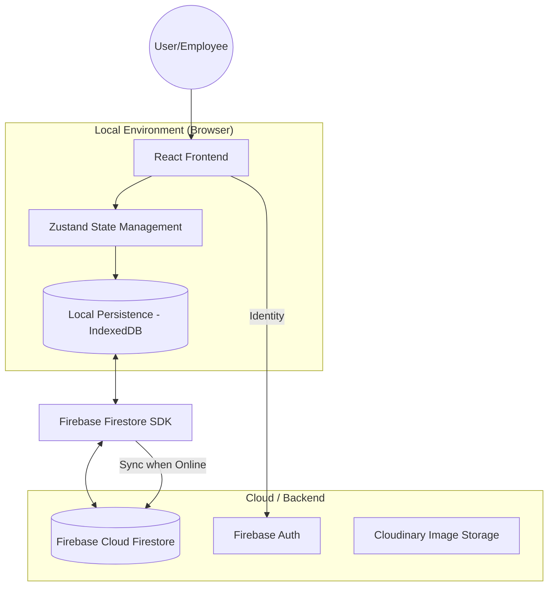

# Smart Retail OS – Offline-First Retail Management System
## Professional Project Documentation & Final Year Report (BCA)

---

## 1. Introduction

### 1.1 Project Overview
**Smart Retail OS** is a high-performance, specialized retail management and Point-of-Sale (POS) system designed primarily for electronics and mobile retail businesses. Built with a modern "Offline-First" philosophy, it ensures that critical retail operations—such as billing and inventory lookups—remain functional even during internet outages, synchronizing data automatically once connectivity is restored.

### 1.2 Objectives
*   **Business Continuity:** Implement an offline-first architecture to prevent sales downtime.
*   **Inventory Precision:** Specialized tracking for high-value electronics (IMEI/Serial numbers).
*   **AI-Driven Intelligence:** Automate restocking processes using historical sales velocity.
*   **Security:** Enforce strict Role-Based Access Control (RBAC) to protect sensitive profit margins.
*   **User Experience:** Provide a premium, responsive, and "app-like" interface for fast-paced retail environments.

### 1.3 Problem Statement
Traditional retail systems often face:
*   **Connectivity Dependency:** Cloud-only systems stop working if the internet goes down.
*   **Manual Inventory Errors:** Overstocking or stock-outs due to poor demand forecasting.
*   **Complex Electronics Handling:** Difficulty tracking specific device conditions (Second-hand) or unique identifiers (IMEI).
*   **Lack of Insights:** Difficulty in visualizing profit trends and customer loyalty in real-time.

### 1.4 Proposed Solution
A unified OS that combines:
1.  **Firebase Real-time Sync** with local persistence for offline reliability.
2.  **Predictive AI Engine** for automated stock replenishment.
3.  **Specialized Modules** for IMEI tracking, Second-hand evaluation, and Returns management.
4.  **Comprehensive Analytics** dashboard for data-driven decision making.

---

## 2. System Architecture

### 2.1 Offline-First Architecture
The system utilizes **Firebase Firestore's Persistent Cache** mechanism. This allows the application to:
1.  Write data to a local IndexedDB cache immediately.
2.  Read data from the local cache even when offline.
3.  Automatically synchronize the local "Sync Queue" with the cloud once the browser detects an active internet connection.

### 2.2 Data Flow Diagram


### 2.3 Technologies Used
*   **Frontend Library:** React 19 (Hooks, Context, Concurrent Mode).
*   **Build Tool:** Vite (Ultra-fast HMR).
*   **Styling:** Tailwind CSS v4 (Modern utility-first architecture).
*   **Database:** Firebase Firestore (Real-time NoSQL).
*   **State Management:** Zustand (Cart & Global Settings).
*   **Animations:** Framer Motion (Premium micro-interactions).
*   **Analytics:** Recharts (SVG-based data visualization).
*   **Reporting:** jsPDF & AutoTable (Invoice & Report generation).

---

## 3. Features

### 3.1 Inventory Management
*   **IMEI Tracking:** Unique identification for mobile devices.
*   **Stock Thresholds:** Visual indicators for low/out-of-stock items.
*   **Batch Restocking:** Update multiple product quantities simultaneously.
*   **Category Organization:** Clean grouping of products (Phones, Laptops, Accessories, etc.).

### 3.2 Billing & Checkout System
*   **Smart Cart:** Real-time price and tax (GST) calculation.
*   **Customer Integration:** Link invoices to existing or new customer profiles.
*   **Payment Versatility:** Supports UPI, Card, and Cash transactions.
*   **Instant Invoices:** Automated generation of professional PDF receipts.

### 3.3 Customer Management (CRM)
*   **Purchase History:** Track every order associated with a customer.
*   **Loyalty Insights:** Identify VIP customers based on total spend.
*   **Contact Database:** Maintain searchable records of names, phones, and emails.

### 3.4 Analytics Dashboard
*   **Revenue Trends:** 7-day and 30-day growth visualizations.
*   **Profit Analysis:** Automatic calculation of net profit excluding costs/taxes.
*   **Category Distribution:** See which segments are driving the most business.

### 3.5 AI Restock Engine
*   **Sales Velocity:** Calculates daily sales average over a lookback period.
*   **Lead Time Integration:** Considers the time taken for suppliers to deliver.
*   **Automated Suggestions:** Pre-calculates exactly how many units to order to stay optimal.

### 3.6 Second-hand Product Module
*   **Device Condition Grading:** (Excellent, Good, Fair, Damaged).
*   **Battery Health Tracking:** Specific for pre-owned Apple devices.
*   **Repair Disclosure:** Document what parts were replaced or if the device is original.

### 3.7 Reports & Export System
*   **CSV Exports:** Export Products, Orders, and Customers for Excel analysis.
*   **Daily Summaries:** Quick view of the day's performance.

---

## 4. Workflows

### 4.1 Step-by-Step Checkout Process
1.  **Product Selection:** Search for SKU/Name and add items to the cart.
2.  **Customer Validation:** Select an existing customer via phone/name or add a new one.
3.  **Discount & Tax:** Apply manual discounts; 18% GST is automatically calculated.
4.  **Payment Processing:** Select payment method (UPI/Card/Cash).
5.  **Inventory Deduction:** The system atomically decrements stock counts in the database.
6.  **Invoice Generation:** A PDF is created and prompted for download/print.

### 4.2 Inventory Lifecycle
1.  **Creation:** Admin adds a new product with base price, cost price, and category.
2.  **Replenishment:** AI suggests restocking levels based on sales; Admin approves/edits.
3.  **Sale:** Stock levels decrease automatically during checkout.
4.  **Audit:** Changes are logged in the `activityLogs` collection for transparency.

### 4.3 Offline Sync Mechanism
*   **Phase 1 (Offline):** User performs "Add to Cart" and "Checkout".
*   **Phase 2 (Cache):** Firestore SDK saves the new Invoice document and updated Stock document to IndexedDB.
*   **Phase 3 (Online):** Browser reconnects; Firebase SDK detects a "dirty" local cache and pushes all pending writes to the cloud in chronological order.

---

## 5. Database Design

### 5.1 Schema Definitions

#### Collection: `products`
| Field | Type | Description |
| :--- | :--- | :--- |
| `id` | String (UUID) | Unique identifier |
| `name` | String | Product name/model |
| `sku` | String | Unique Stock Keeping Unit |
| `price` | Number | Selling price (incl. tax) |
| `costPrice` | Number | Procurement price (Admin only) |
| `stock` | Number | Current units in store |
| `category` | String | e.g., "Phones", "Laptops" |
| `imei` | String[] | Array of serial numbers for high-value items |
| `isSecondHand` | Boolean | True if the product is pre-owned |
| `shDetails` | Object | Condition, Battery health, Repair status |

#### Collection: `orders` (Invoices)
| Field | Type | Description |
| :--- | :--- | :--- |
| `orderNumber` | String | Unique human-readable ID (e.g., INV-001) |
| `customerId` | String | Reference to customer document |
| `lineItems` | Array<Item> | Array of {productId, quantity, unitPrice, total} |
| `total` | Number | Final billing amount |
| `gst` | Number | Total tax amount |
| `paymentMethod` | "UPI" \| "Card" \| "Cash" | Method used for payment |
| `createdAt` | Timestamp | Server-side creation time |
| `status` | String | "Completed", "Returned", "Cancelled" |

#### Collection: `customers`
| Field | Type | Description |
| :--- | :--- | :--- |
| `name` | String | Customer full name |
| `phone` | String | Primary contact (Unique search key) |
| `email` | String | Optional email |
| `totalSpent` | Number | Aggregated purchase value |

### 5.2 Relationships & ER Explanation
*   **One-to-Many:** One Customer can have many Orders.
*   **One-to-Many:** One Order contains multiple Line Items (Products).
*   **Reference-based:** Orders store `customerId` and `productId` as strings (Normalization) to allow efficient pivoting and lookup in NoSQL environment.

---

## 6. User Roles & Permissions

| Feature | Admin | Employee |
| :--- | :--- | :--- |
| **View Sales** | Yes (With Profit) | Yes (Revenue Only) |
| **Delete Products** | Yes | No |
| **View Cost Price** | Yes | No |
| **Edit Settings** | Yes | No |
| **Create Invoices** | Yes | Yes |
| **Process Returns** | Yes | Yes |

---

## 7. UI/UX Overview

### 7.1 Dashboard Structure
The dashboard is split into four primary quadrants:
1.  **KPI Header:** Real-time counters for Today's Revenue, Active Orders, and Low Stock alerts.
2.  **Main Chart:** Area chart showing sales volume trends.
3.  **Secondary Context:** Categorical distribution (Donut chart).
4.  **Activity Feed:** Recent transactions and system logs.

### 7.2 Navigation Flow
*   **Sidebar:** Persistent left-side navigation for fast switching between Inventory, Orders, and Customers.
*   **Mobile View:** Responsive hamburger menu for small viewports.
*   **Modals:** Used for all input forms (Add Product, Restock, Return) to maintain contextual focus.

---

## 8. Installation & Setup

### 8.1 Requirements
*   Node.js v18+ 
*   Firebase Project (Firestore & Auth enabled)
*   NPM or Yarn

### 8.2 Steps to Run
1.  **Clone Repository:** `git clone <repo-url>`
2.  **Install Dependencies:** `npm install`
3.  **Setup Environment:**
    Create a `.env` file in the root:
    ```env
    VITE_FIREBASE_API_KEY=your_key
    VITE_FIREBASE_AUTH_DOMAIN=your_domain
    VITE_FIREBASE_PROJECT_ID=your_id
    ```
4.  **Launch Dev Server:** `npm run dev`
5.  **Build for Production:** `npm run build`

---

## 9. Challenges & Solutions

### 9.1 Offline Data Consistency
*   **Challenge:** If two offline clerks update the same product stock, a conflict occurs when they go online.
*   **Solution:** Implemented **Atomic Increments** using Firestore's `increment()` field value. This ensures that even if updates are out of order, the final math is correct (e.g., -1 sold on device A and -1 sold on device B both get applied to the total).

### 9.2 High-Fidelity PDF Generation
*   **Challenge:** Browser print functions are inconsistent across browsers.
*   **Solution:** Integrated **jsPDF-AutoTable** to generate identical, pixel-perfect invoice PDFs on the client-side regardless of the device.

---

## 10. Future Enhancements

1.  **AI Business Consultant:** Integrating an LLM (like Gemini) to provide natural language insights into business bottlenecks.
2.  **Barcode Scanning:** native mobile camera integration for rapid SKU searching.
3.  **Multi-Store Support:** Centralized dashboard for owners with multiple retail locations.
4.  **Automatic Supplier Ordering:** Automated email/WhatsApp notifications sent to suppliers when stock is low.

---

**Developed & Maintained by:** Smart Retail OS Team
**Academic Purpose:** BCA Final Year Project Report
**Date:** April 2026
